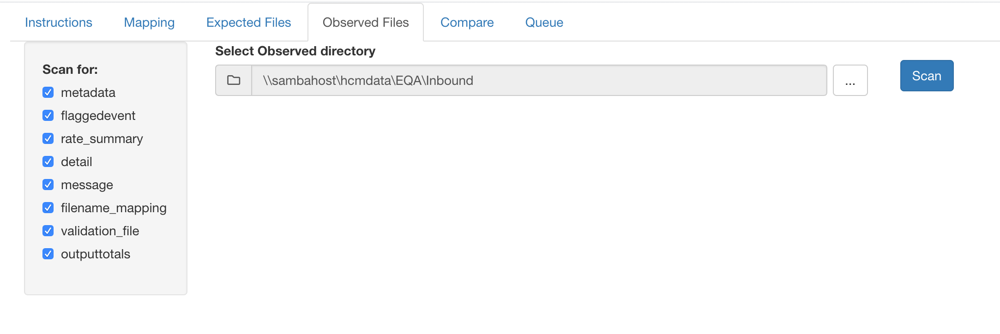

# shiny example

This example was constructed to show a previous project that I built; it compared **Observed** vs **Expected** of a large ETL process and data set prior to loading for validation - much of the code has been removed, however it should showcase enough for tab control and markdown rendering.  Loading data into hadoop and through various process may take up to 12 hours, this app was constructed to get some preliminary results much more quickly.

In the real project - it would be tied to events, charts, data, markdown/bookdown.

